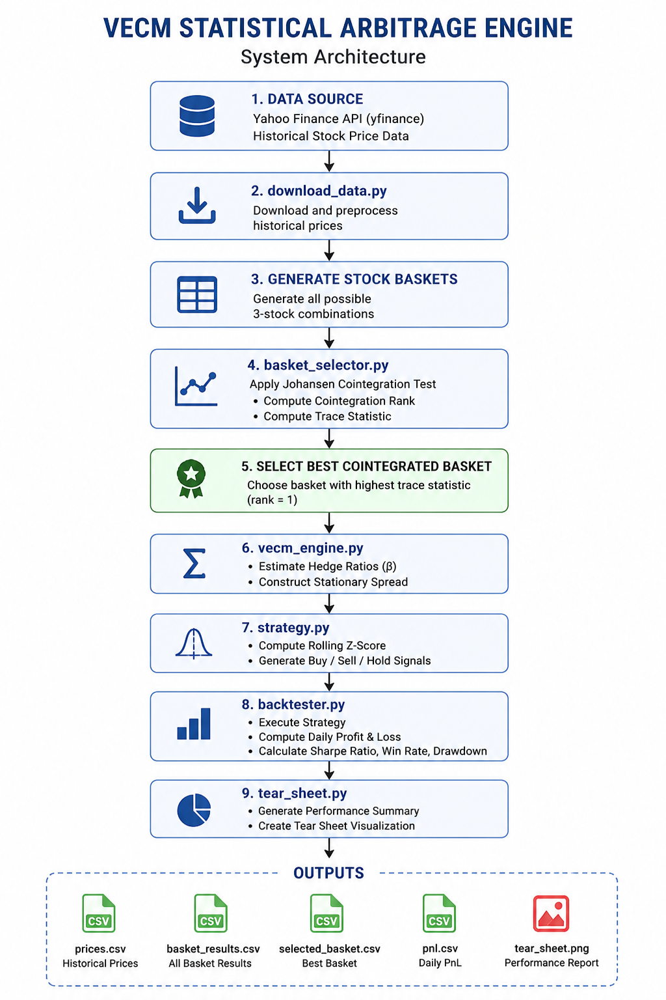

# VECM Statistical Arbitrage Engine

## Overview

This project implements a statistical arbitrage strategy using a Vector Error Correction Model (VECM). The idea behind the strategy is that some stocks move together over the long run, and whenever they temporarily drift apart, they tend to move back towards their normal relationship.

The project downloads historical stock prices from Yahoo Finance, identifies cointegrated stock baskets using the Johansen cointegration test, builds a spread using the estimated hedge ratios, and backtests a simple mean reversion strategy based on the spread's Z-score.

## System Architecture

## Features

a. Downloads historical stock price data from Yahoo Finance.

b. Tests different stock baskets for cointegration using the Johansen test.

c. Selects the strongest basket based on the cointegration rank and trace statistic.

d. Constructs a spread using the estimated hedge ratios.

e. Generates buy and sell signals using the spread's Z-score.

f. Backtests the trading strategy.

g. Generates performance metrics and a tear sheet.

## Project Structure
.
├── config.py
├── download_data.py
├── basket_selector.py
├── vecm_engine.py
├── strategy.py
├── backtester.py
├── tear_sheet.py
├── requirements.txt
├── README.md
├── prices.csv
├── basket_results.csv
├── selected_basket.csv
├── pnl.csv
└── tear_sheet.png

## Requirements

Install the required libraries using:
pip install -r requirements.txt

Required packages:

a. numpy

b. pandas

c. matplotlib

d. statsmodels

e. yfinance

## Running the Project

1] Download historical data
python download_data.py

This downloads historical stock prices and stores them in `prices.csv`.

2] Run the backtest
python backtester.py

This script:

a. Finds all valid cointegrated baskets.

b. Selects the strongest basket.

c. Builds the trading strategy.

d. Runs the backtest.

e. Saves the daily PnL as `pnl.csv`.

3] Generate the performance report
python tear_sheet.py

This creates the performance summary and saves the charts as `tear_sheet.png`.

## Methodology

The implementation follows these steps:

a. Download historical stock prices.

b. Generate all possible three-stock baskets.

c. Apply the Johansen cointegration test to every basket.

d. Select the basket with the highest cointegration rank. If more than one basket has the same rank, the trace statistic is used as a tie-breaker.

e. Estimate the hedge ratios using the first cointegrating eigenvector.

f. Construct the spread.

g. Calculate the rolling Z-score of the spread.

h. Generate trading signals.

i. Backtest the strategy.

j. Evaluate the results using cumulative PnL, Sharpe ratio and drawdown.

## Trading Strategy

The strategy assumes that the spread between cointegrated stocks is mean reverting.

The trading rules are simple:

a. Go long when the Z-score falls below -2.

b. Go short when the Z-score rises above +2.

c. Exit the position when the absolute Z-score becomes smaller than 0.5.

## Output Files

| File | Description |
|------|-------------|
| prices.csv | Historical stock prices |
| basket_results.csv | Cointegration statistics for valid baskets |
| selected_basket.csv | Selected basket used in the strategy |
| pnl.csv | Daily profit and loss |
| tear_sheet.png | Performance charts |

## Performance Metrics

The backtest reports the following metrics:

a. Total Profit and Loss (PnL)

b. Sharpe Ratio

c. Winning Days

d. Losing Days

e. Win Rate

f. Maximum Drawdown

The tear sheet also provides plots of cumulative PnL, rolling Sharpe ratio and drawdown.

## Limitations

This project is a simplified implementation of a statistical arbitrage strategy.

Some limitations are:

a. Results depend on the historical data available from Yahoo Finance.

b. Transaction costs are modeled in a simplified manner.

c. Fixed entry and exit thresholds are used throughout the backtest.

d. Position sizing and risk management are kept simple.

## License

This project was developed for educational purposes. demonstrating the application of VECM, cointegration analysis, and quantitative trading concepts.
